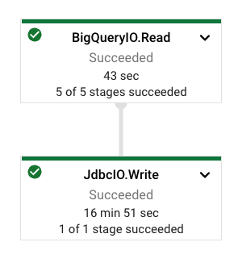

# DataflowExamples
Dataflow Examples Repo

Example how to transfer BigQuery table to Cloud SQL using Dataflow

Steps to run the Dataflow pipeline from local:

Run: 
  > **gcloud auth application-default login**

Set up GOOGLE_APPLICATION_CREDENTIALS envirenment variable: 
  > ***export GOOGLE_APPLICATION_CREDENTIALS="<your path for the key>"***
  
 Run the pipeline: 
  > ***mvn -Pdataflow-runner compile exec:java \
  >  -Dexec.mainClass=com.click.example.BikeTrip \
  >  -Dexec.args="--project=${projrct_id} \
  >  --gcpTempLocation=gs://${bucket_name}/temp/ \
  >  --tempLocation=gs://${bucket_name}/temp/ \
  >  --runner=DataflowRunner \
  >   --region=us-central1"***
  
 Dataflow run: 
 
